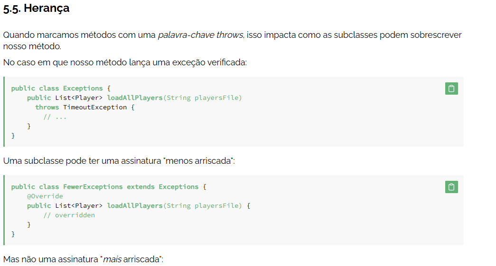

 ----- Exception
  Hierarquia + custom exceptions

Existem três categorias principais de condições excepcionais:

Exceções verificadas
Exceções não marcadas 
/ Exceções em tempo de execução
Erros

Exceções marcadas são exceções que o compilador Java exige que tratemos
Exceções não marcadas são exceções que o compilador Java não exige que lidemos.

finally sempre roda

Java nos permite lidar com exceções de subclasses separadamente

mais de uma exception no mesmo catch  } catch (IOException | NumberFormatException e) {

 --------- optional
 
optional is a abstration to use in moments that you dont know if the variable is null/undefied or not. Like an api call
- pode ser usado metodos para stream(tipo map e outros)
- User user = repository.findById(id)
  .orElseThrow(() -> new BusinessException("User not found"));

 ---------- Records

java 14 Feature - To simplified a simple classe creation
 - Tipo um dto classe normal só q porem muito mais simples e rapido de criar

exemplo utilizando como padrao DTO

